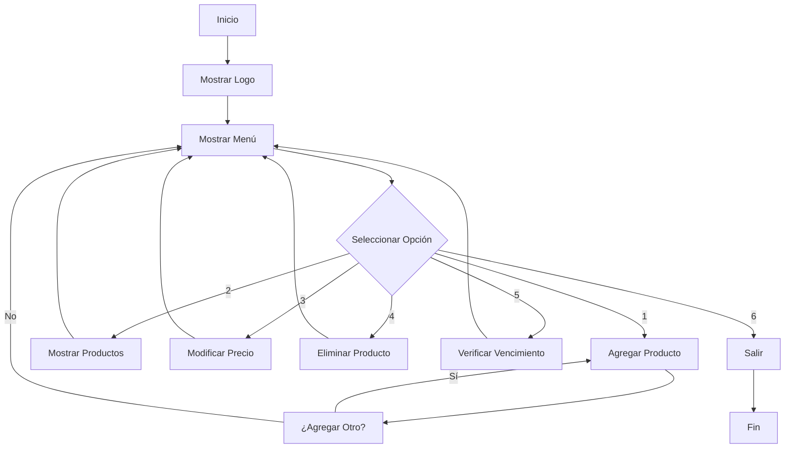

# 🛒 Sistema de Gestión de Supermercado Sencillo

Un sistema de gestión de inventario para supermercados desarrollado en Java que permite administrar productos, controlar vencimientos y gestionar el inventario de manera eficiente.

## 📋 Descripción

Este programa simula un sistema de gestión de inventario para supermercados, ofreciendo funcionalidades completas para el manejo de productos, incluyendo registro, modificación, eliminación y control de fechas de vencimiento. El sistema utiliza una interfaz de consola con colores y elementos visuales atractivos para mejorar la experiencia del usuario.

## ✨ Características Principales

### 🔧 Funcionalidades Core
- ✅ **Registro de Productos**: Agregar múltiples productos con información completa
- 👀 **Visualización de Inventario**: Mostrar todos los productos registrados con detalles
- 🔃 **Modificación de Precios**: Actualizar precios de productos existentes
- ❌ **Eliminación de Productos**: Remover productos del inventario
- 📅 **Control de Vencimientos**: Sistema inteligente de verificación de fechas
- 🎨 **Interfaz Colorida**: Uso de colores en consola para mejor experiencia

### 📊 Gestión Inteligente de Vencimientos
- 🟢 **Estado Excelente**: Productos con más de 30 días
- 🟡 **En Seguimiento**: Productos de 4-7 días para vencer
- 🟠 **Próximo a Vencer**: Productos de 1-3 días (con alertas)
- 🔴 **Productos Vencidos**: Detección automática y recomendaciones

## 🏗️ Estructura del Proyecto

```
supermercadoSencillo/
├── supermercadoSencillo.java    # Clase principal
├── misUtilidades/               # Paquete de utilidades
│   ├── ValidadorEntrada.java    # Validación de entradas
│   └── ColoresConsola.java      # Colores para consola
└── README.md                    # Este archivo
```

## 📦 Información de Productos

Cada producto almacena la siguiente información:

| Campo | Tipo | Descripción |
|-------|------|-------------|
| `ID` | String | Identificador único (UUID) |
| `Nombre` | String | Nombre del producto |
| `Precio` | Integer | Precio unitario en pesos |
| `Cantidad` | Integer | Unidades disponibles en bodega |
| `Vencimiento` | LocalDate | Fecha de vencimiento |
| `Foto Uno` | String | URL de la primera fotografía |
| `Foto Dos` | String | URL de la segunda fotografía |
| `Descripción` | String | Descripción detallada |
| `Categoría` | String | Categoría del producto |
| `Proveedor` | String | Nombre del proveedor |

## 🚀 Cómo Usar

### Prerrequisitos
- Java 8 o superior
- Paquete `misUtilidades` con las clases de validación y colores

### Ejecución
```bash
javac supermercadoSencillo.java
java supermercadoSencillo
```

### 📋 Menú Principal

El sistema presenta un menú interactivo con las siguientes opciones:

```
🔷 1️⃣ AGREGAR PRODUCTO ➕
🔷 2️⃣ MOSTRAR PRODUCTO 👀  
🔷 3️⃣ MODIFICAR PRODUCTO 🔃
🔷 4️⃣ ELIMINAR PRODUCTO ✖️
🔷 5️⃣ CALCULAR VENCIMIENTO 🤢
🔷 6️⃣ SALIR DEL MENÚ 🚫
```

## 🔍 Funcionalidades Detalladas

### 1. 📝 Agregar Productos
- Permite registrar múltiples productos en secuencia
- Validación automática de tipos de datos
- Generación automática de ID único
- Confirmación para agregar productos adicionales

### 2. 👁️ Mostrar Inventario
- Lista completa de todos los productos registrados
- Información detallada de cada producto
- Formato visual organizado con separadores

### 3. 💰 Modificar Precios
- Selección de producto por nombre exacto
- Validación de existencia del producto
- Confirmación antes de realizar cambios
- Reporte de cambio con precio anterior y nuevo

### 4. 🗑️ Eliminar Productos
- Lista de productos disponibles para eliminación
- Validación de nombre exacto
- Confirmación de seguridad
- Actualización automática del inventario

### 5. 📊 Control de Vencimientos

#### Estados del Producto:
- **🌟 Excelente** (>30 días): Producto muy fresco
- **✅ Bueno** (8-30 días): Condiciones normales
- **📋 En Seguimiento** (4-7 días): Monitorear semanalmente
- **⚠️ Próximo a Vencer** (1-3 días): Acción urgente requerida
- **🚨 Vence Hoy** (0 días): Último día de venta
- **💀 Vencido** (<0 días): Eliminar del inventario

#### Recomendaciones Automáticas:
- **1 día**: Descuento del 50%
- **2 días**: Descuento del 30%
- **3 días**: Descuento del 15%
- **Vencido (+3 días)**: Eliminación automática opcional

## 🛡️ Validaciones y Seguridad

- ✅ Validación de tipos de datos numéricos
- ✅ Verificación de existencia de productos
- ✅ Confirmaciones de seguridad para operaciones críticas
- ✅ Manejo de inventario vacío
- ✅ Validación de fechas de vencimiento
- ✅ Protección contra eliminaciones accidentales

## 🎨 Características Visuales

- 🌈 **Colores de Consola**: Mejora la legibilidad y experiencia
- 🎭 **ASCII Art**: Logo y elementos visuales atractivos
- 📊 **Formato Organizado**: Separadores y estructura clara
- 🚦 **Semáforo de Estados**: Indicadores visuales de estado
- 📋 **Reportes Detallados**: Información completa y organizada

## 🔧 Dependencias

### Clases Requeridas (Paquete `misUtilidades`):

#### `ValidadorEntrada.java`
```java
// Métodos requeridos:
- leerByte(Scanner scanner)
- leerEntero(Scanner scanner)  
- leerFecha(Scanner scanner)
```

#### `ColoresConsola.java`
```java
// Constantes requeridas:
- TEXTO_AMARILLO
- TEXTO_ROJO
- TEXTO_VERDE
- TEXTO_CIAN
- TEXTO_BLANCO
- TEXTO_MAGENTA
```

## 📈 Flujo del Programa



## 💡 Casos de Uso

### Ejemplo de Uso Típico:
1. **Inicio de Sesión**: El usuario inicia el programa
2. **Agregar Productos**: Registra el inventario inicial
3. **Consultar Estado**: Revisa productos próximos a vencer
4. **Tomar Acción**: Modifica precios o elimina productos vencidos
5. **Gestión Continua**: Mantiene el inventario actualizado

## 🚨 Notas Importantes

- ⚠️ **Primera Ejecución**: Debe agregar al menos un producto antes de usar otras opciones
- 🔄 **Persistencia**: Los datos se mantienen solo durante la ejecución del programa
- 📝 **Nombres Exactos**: Para modificar/eliminar productos, usar nombres exactos
- 🗑️ **Productos Vencidos**: El sistema ofrece eliminación automática después de 3 días

## 🐛 Limitaciones Conocidas

- No hay persistencia de datos (se pierden al cerrar)
- No hay función de búsqueda por ID o categoría
- No hay reportes de ventas o estadísticas
- No hay validación de URLs de fotografías
- No hay funcionalidad de backup/restore


## 📄 Licencia

Proyecto de código abierto para fines educativos.

---
